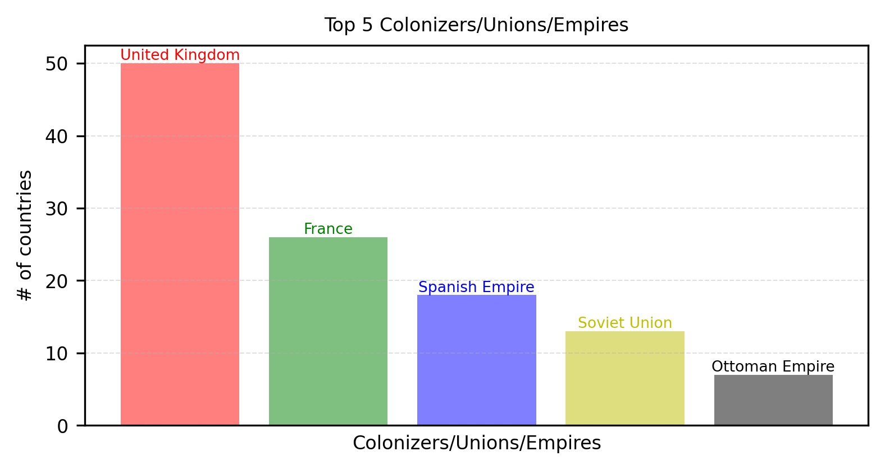
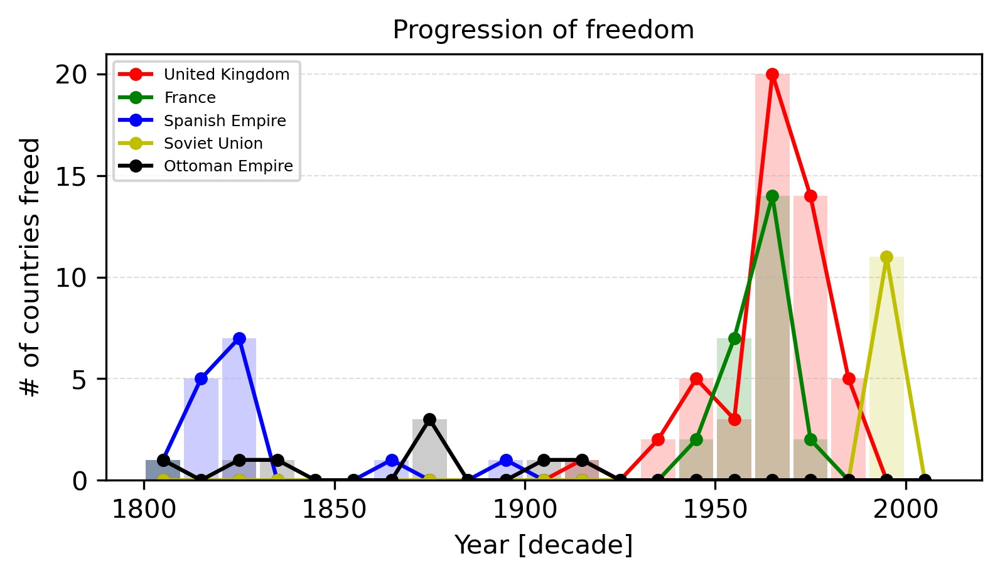

# Fall of colonizers, empires, and unions: An analysis using web scraping and data science tools.

This project is a result of our curiosity. We wanted to know more about colonizers, empires, and unions (CEU) that
invaded/controlled other countries in the world. We mined data from Wikipedia
[Link](https://en.wikipedia.org/wiki/List_of_national_independence_days) and analyzed it with NumPy, Pandas, and
matplotlib.

PS: We are still working on this project and will keep updating.

## Results
Top five  CEU

Number of countries freed in a decade as a function of decade starting from 1800 to 2010  

## Note
Suggestions are welcome.

If you use this code, send me a pizza at mail02ankit@gmail.com

## Contributors
[Ankit Kumar](https://mail02ankit.github.io/)
[Anshu Gupta](https://anshu02gupta.github.io/)
